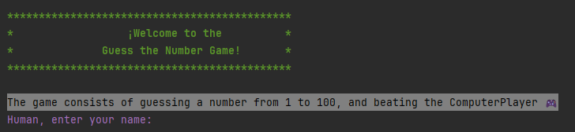
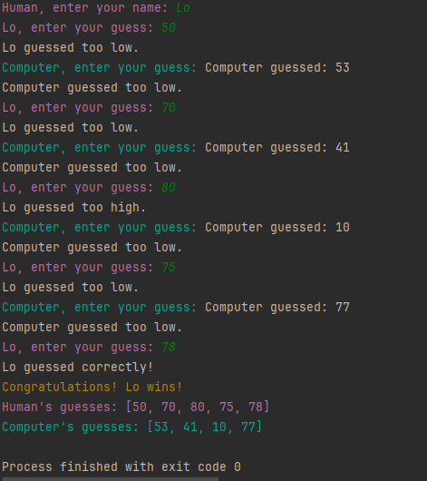
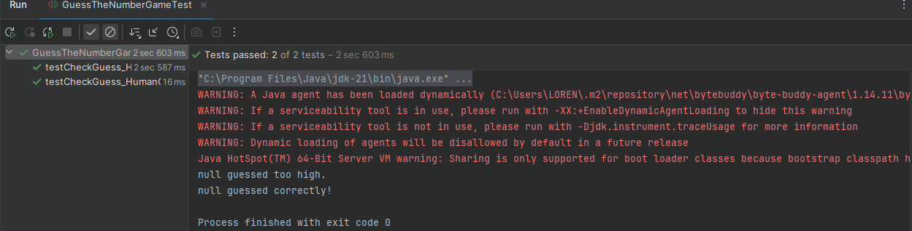
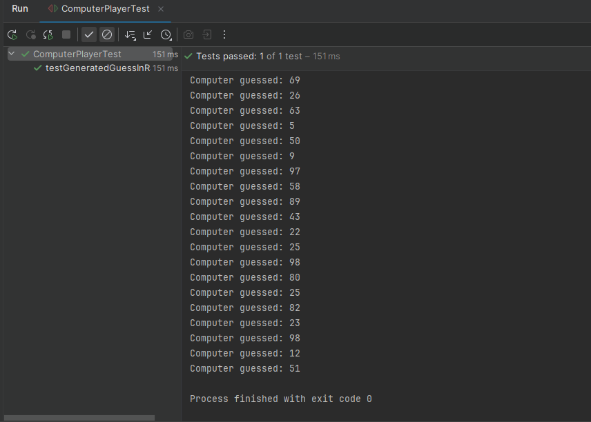
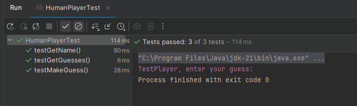

# Adivina el Número - Guess the Number

# Guess the Number Game

## Descripción
Este proyecto implementa un juego de adivinanza de números en Java. El juego consiste en que un jugador (ya sea humano o computadora) intente adivinar un número secreto generado aleatoriamente por el programa.

## Funcionalidades
- El jugador humano puede ingresar su nombre.
- El juego genera un número aleatorio entre 1 y 100 como el número objetivo.
- Los jugadores (humano y computadora) hacen suposiciones sobre el número objetivo.
- El juego indica si las suposiciones son demasiado altas, demasiado bajas o correctas.
- El juego termina cuando un jugador adivina correctamente el número objetivo.
- Al final del juego, se muestra el historial de suposiciones de cada jugador.

## Instrucciones de Ejecución
1. Clona este repositorio en tu máquina local.
2. Abre el proyecto en tu IDE favorito.
3. Ejecuta el archivo `GuessTheNumberGame.java` para comenzar el juego.

## Requisitos
- Java JDK 8 o superior.

## Estructura del Proyecto
El proyecto está organizado de la siguiente manera:

¡Claro! Aquí tienes un ejemplo básico de cómo podrías estructurar un archivo README.md para tu proyecto en formato Markdown:

markdown
Copy code
# Guess the Number Game

## Descripción
Este proyecto implementa un juego de adivinanza de números en Java. El juego consiste en que un jugador (ya sea humano o computadora) intente adivinar un número secreto generado aleatoriamente por el programa.

## Funcionalidades
- El jugador humano puede ingresar su nombre.
- El juego genera un número aleatorio entre 1 y 100 como el número objetivo.
- Los jugadores (humano y computadora) hacen suposiciones sobre el número objetivo.
- El juego indica si las suposiciones son demasiado altas, demasiado bajas o correctas.
- El juego termina cuando un jugador adivina correctamente el número objetivo.
- Al final del juego, se muestra el historial de suposiciones de cada jugador.

## Instrucciones de Ejecución
1. Clona este repositorio en tu máquina local.
2. Abre el proyecto en tu IDE favorito.
3. Ejecuta el archivo `GuessTheNumberGame.java` para comenzar el juego.

## Requisitos
- Java JDK 8 o superior.

## Estructura del Proyecto
El proyecto está organizado de la siguiente manera:
GuessTheNumberGame/
├── src/
│ ├── GuessTheNumberGame.java
│ ├── HumanPlayer.java
│ ├── ComputerPlayer.java
│ └── Player.java
└── test/
├── ComputerPlayerTest.java
└── HumanPlayerTest.java

## Tests

### Descripción de los Tests

En este proyecto, se han incluido tests para garantizar el correcto funcionamiento de las principales funcionalidades. A continuación, se describe cada uno de los tests realizados:

#### GuessTheNumberGameTest

- `testCheckGuess_HumanGuessTooHigh`: Este test verifica que el método `checkGuess` maneje correctamente el caso en que la suposición del jugador humano sea demasiado alta.
- `testCheckGuess_HumanGuessCorrect`: En este test se asegura que el método `checkGuess` funcione correctamente cuando la suposición del jugador humano es correcta.

#### ComputerPlayerTest

- `testGeneratedGuessInRange`: Este test comprueba que el método `makeGuess` del jugador de la computadora genere suposiciones dentro del rango esperado.

#### HumanPlayerTest

- `testMakeGuess`: Verifica que el método `makeGuess` del jugador humano funcione correctamente al aceptar la entrada del usuario.
- `testGetName`: Este test asegura que el método `getName`

## Desarrollo y Contribución
Si deseas contribuir al proyecto, puedes seguir estos pasos:
1. Haz un fork del repositorio.
2. Clona tu fork en tu máquina local.
3. Crea una rama para tu función o corrección de errores: `git checkout -b feature/NombreDeLaFuncion`.
4. Haz tus cambios y confirma: `git commit -m "Descripción de tus cambios"`.
5. Sube tu rama a tu repositorio en GitHub: `git push origin feature/NombreDeLaFuncion`.
6. Abre un pull request en el repositorio original.

## Licencia
Este proyecto está bajo la Licencia MIT. Para más información, consulta el archivo [LICENSE](LICENSE).
