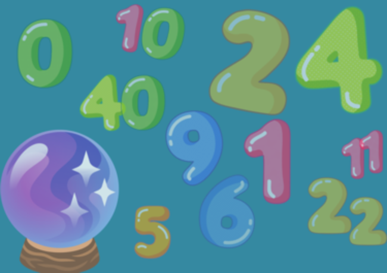

# Piensa un Número - Think Of a Number

## Índice

- [1. Preámbulo](#1-preámbulo)
- [2. Resumen del Proyecto](#2-resumen-del-proyecto)
- [3. Consideraciones Generales y como jugar](#3-consideraciones-generales-y-como-jugar)
- [4. Consideraciones Técnicas](#4-consideraciones-técnicas)
- [5. Diagrama de Clases](#5-diagrama-de-clases)
- 

---

## 1. Preámbulo

Adivinar un número es una forma de acertijo sencillo donde se pone a prueba tu lógica y razonamiento para encontrar un número en la menor cantidad de intentos posibles. Un desafío mental que estimula el pensamiento abstracto.  

## 2. Resumen del Proyecto

Piensa un Número es un juego donde tendrás que competir contra la computadora para adivinar un número secreto aleatorio que está entre 1 y 100 al interpretar las pistas proporcionadas por el juego en cuanto a tus suposiciones.

## 3. Consideraciones Generales y como jugar

Este juego funciona en el terminal, lugar en que realizaremos todas nuestras suposiciones y donde se mostraran las suposiciones de nuestro adversario, la computadora.

### **Instrucciones del juego**

- Deberás competir contra la computadora.
- Debes ingresar tu nombre al empezar.
- La jugadora y el ordenador se turnarán para adivinar el número.
- Se utilizará un número aleatorio entre 1 y 100 como número secreto.
- El juego te indicará si tu suposición debe ser más alta o más baja.
- Al ganar se muestra un mensaje de felicitaciones, historial de suposiciones y la cantidad de intentos de ambos jugadores.
- Al perder se muestra un mensaje correspondiente junto al historial de suposiciones e intentos.

**_¡Diviértete adivinando el número secreto! 🎲🎮_**

## 4. Consideraciones Técnicas

- El juego se lleva a cabo en el terminal usando Java.
- La lógica del juego se basa en estructuras de control, incluyendo bucles,
  condicionales y colecciones.
- Se divide el código para mejorar su legibilidad y mantenimiento.
- Se utilizó una funcionalidad de la biblioteca de utilidades de Java para
  la generación de números aleatorios.
- Se realizarón **pruebas unitarias** para sus clases y métodos
  utilizando JUnit y simulación de generación de números aleatorios con Mockito.

### 5. Diagrama de Clases

#### `GuessTheNumberGame`

**Propósito:**
Maneja la lógica principal, decide qué jugador asume el próximo turno.

**Atributos:**

- `random`: Generador de números aleatorios.
- `targetNumber`: Número aleatorio entre 1 y 100 a adivinar en la partida actual.

**Métodos estáticos (`static`):**

- `main(String[] args)`: Inicia el juego y genera el número aleatorio.
- `checkGuess(Player player)`: Ejecuta un turno, obtiene la suposición
  y evalúa el nuevo estado de la partida.

#### `Player`

**Propósito:**
Representa a una jugadora genérica. Es una clase abstracta.
Define los atributos y métodos que todas las _clases_ de jugadoras deben compartir:

**Atributos:**

- `name`: El nombre de la jugadora.
- `guesses`: El historial de suposiciones de la jugadora.

**Métodos:**

- `makeGuess()`: Devuelve la suposición de la jugadora. Es un método abstracto.
- `getName()`: Devuelve el nombre de la jugadora.
- `getGuesses()`: Devuelve el historial de suposiciones de la jugadora.

#### `HumanPlayer` y `ComputerPlayer` (heredan de `Player`)

**Propósito:**
Representa a las jugadoras _Humana_ y _Computadora_, respectivamente.

**Métodos:**

- `makeGuess()`: Método que cada clase que hereda de `Player` debe implementar.

**Relaciones:**

- La clase `GuessTheNumberGame` interactúa con las clases `HumanPlayer`
  y `ComputerPlayer` para gestionar el juego.
- Tanto la clase `HumanPlayer` como `Computer Player` son subclases de `Player`,
  lo que implica que heredan todas sus propiedades y métodos,
  pero también tienen algunas características adicionales propias.

Este diseño de clases permite separar las responsabilidades,
facilitando el mantenimiento y posibles extensiones del juego en el futuro.

